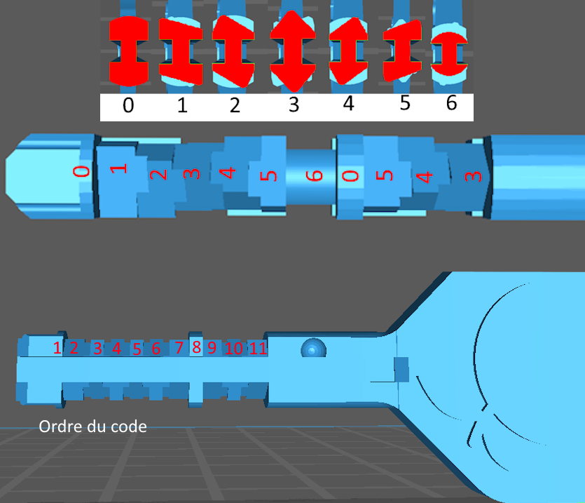

# Parametrically Generated 3D Printable ABLOY DISKLOCK and DISKLOCK PRO Keys

Inspired by [NVX's 3D printed protect key](https://github.com/nvx/protec-3d-printing) and
This OpenSCAD model generates keys for the ABLOY DISKLOCK / DISKLOCK PRO locks.

## 3D Printing

Functional keys have been produced from this model, using an Creality Halot one plus resin-based printer.

The models generated by this library are designed to allow printing flat on the bed with no supports.

FDM printers are unlikely to have sufficient accuracy to print a functional key, but I would be interested in hearing
if someone manages to with a non-SLA/DLP printer!

## Usage

The easiest way to use this is to create a new `.scad` file that uses the `abloy_disklock.scad` library, eg:

Navigate to the folder where you installed Openscad then copy past the scad file and the blank stl in the libraries folder `\OpenSCAD\libraries`

```scad
use <abloy_disklock.scad>

abloy_disklock_pro([0,4,3,2,3,6,2,0,4,3,1]);
```
## Decode your key

you need to pass 11 cuts to generate a working key.

first disc and 8 disc are always 0 cut because they are there to tension the lock while turning the key



If anyone experiments with this or wants to send me other disc detainer core to play with I'd love to hear from you.
